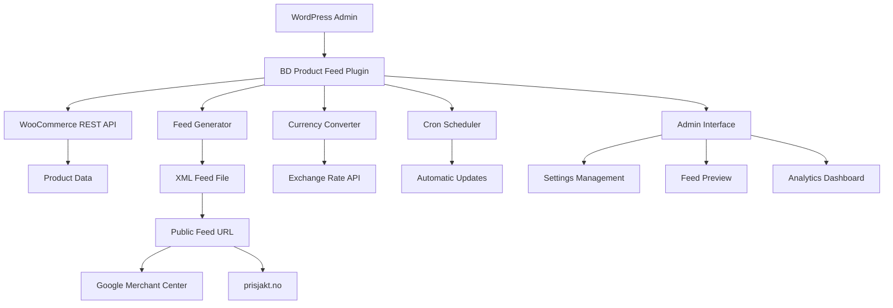
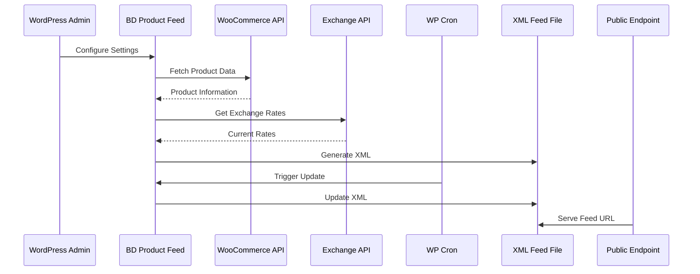

# 🏗️ BD Product Feed - Technical Architecture Plan

## System Overview

The BD Product Feed plugin will be a comprehensive WordPress plugin that generates Google Merchant Center compatible XML feeds from WooCommerce product data. It will feature automatic currency conversion, multilingual support, and scheduled updates.

## Core Architecture



## Plugin Structure

```
bd-product-feed/
├── bd-product-feed.php                 # Main plugin file
├── bd-menu-helper.php                  # BD menu integration
├── includes/
│   ├── class-bd-updater.php           # GitHub auto-updater
│   ├── class-bd-product-feed-core.php # Core functionality
│   ├── class-bd-feed-generator.php    # XML feed generation
│   ├── class-bd-currency-converter.php # Currency conversion
│   ├── class-bd-product-filter.php    # Product filtering
│   ├── class-bd-cron-manager.php      # Scheduled tasks
│   ├── class-bd-feed-validator.php    # Feed validation
│   └── class-bd-admin-interface.php   # Admin UI
├── admin/
│   ├── css/
│   │   └── admin.css                  # BD design system styles
│   ├── js/
│   │   └── admin.js                   # Admin JavaScript
│   └── templates/
│       ├── admin-dashboard.php        # Main admin page
│       ├── feed-settings.php          # Feed configuration
│       ├── product-selection.php      # Product filtering
│       └── analytics.php              # Statistics view
├── public/
│   └── feed-endpoint.php              # Public feed URL handler
├── languages/                         # Translation files
├── assets/
│   └── images/                        # Plugin icons/images
├── .github/
│   └── workflows/
│       └── release.yml                # Auto-release workflow
└── README.md
```

## Technical Specifications

### 1. Feed Generation System
- **Format**: Google Merchant Center XML (RSS 2.0 based)
- **Required Fields**: id, title, description, link, image_link, availability, price, brand, condition
- **Optional Fields**: sale_price, product_type, google_product_category, shipping
- **Performance**: Batch processing for large catalogs (1000+ products)

### 2. Currency Conversion
- **API Integration**: ExchangeRate-API or Fixer.io for real-time rates
- **Supported Currencies**: EUR, USD, SEK, DKK, GBP (expandable)
- **Caching**: 24-hour cache for exchange rates
- **Fallback**: Manual rate configuration if API fails

### 3. Product Filtering
- **Categories**: Multi-select category inclusion/exclusion
- **Product Status**: Published, draft, private filtering
- **Stock Status**: In stock, out of stock, backorder
- **Simple Interface**: Checkbox-based selection

### 4. Scheduling System
- **Cron Integration**: WordPress native cron system
- **Update Frequencies**: Hourly, daily, weekly, manual
- **Error Handling**: Retry mechanism with exponential backoff
- **Notifications**: Email alerts for failed updates

### 5. Admin Interface Design
Following BD Design Guide v3.0:
- **Color Scheme**: BD gradient theme (#667eea to #764ba2)
- **Layout**: Modern card-based design with hover effects
- **Responsive**: Mobile-first approach
- **Accessibility**: WCAG 2.1 compliant

## Data Flow Architecture



## Security Considerations

1. **Feed Access**: Optional password protection for feed URLs
2. **API Keys**: Encrypted storage of currency API keys
3. **Input Validation**: Sanitization of all user inputs
4. **Nonce Protection**: WordPress nonce verification for admin actions
5. **Rate Limiting**: Prevent excessive feed generation requests

## Performance Optimization

1. **Caching Strategy**:
   - Feed files cached for configured intervals
   - Database query optimization with proper indexing
   - Transient caching for API responses

2. **Large Catalog Handling**:
   - Batch processing in chunks of 100 products
   - Memory management for large datasets
   - Progress indicators for long operations

3. **CDN Compatibility**:
   - Static XML file generation for CDN serving
   - Proper cache headers for feed URLs

## Integration Points

### WooCommerce Integration
- **Product Data**: Title, description, price, images, categories
- **Inventory**: Stock status and quantity
- **Variations**: Support for variable products
- **Attributes**: Custom product attributes mapping

### WordPress Integration
- **Multisite**: Compatible with WordPress multisite
- **Multilingual**: WPML and Polylang support
- **Hooks**: Action and filter hooks for extensibility

## Error Handling & Logging

1. **Comprehensive Logging**:
   - Feed generation logs
   - API call logs
   - Error tracking with stack traces
   - Performance metrics

2. **User Notifications**:
   - Admin notices for configuration issues
   - Email alerts for critical errors
   - Dashboard status indicators

3. **Recovery Mechanisms**:
   - Automatic retry for failed operations
   - Fallback to cached data when APIs fail
   - Manual regeneration options

## Analytics & Monitoring

1. **Feed Statistics**:
   - Product count tracking
   - Update frequency monitoring
   - Error rate analysis
   - Performance metrics

2. **Dashboard Widgets**:
   - Feed status overview
   - Recent activity log
   - Quick action buttons

## Google Merchant Center XML Format Specification

### Required XML Structure
```xml
<?xml version="1.0" encoding="UTF-8"?>
<rss version="2.0" xmlns:g="http://base.google.com/ns/1.0">
  <channel>
    <title>Store Name Product Feed</title>
    <link>https://example.com</link>
    <description>Product feed for Google Merchant Center</description>
    <item>
      <g:id>product_id</g:id>
      <g:title>Product Title</g:title>
      <g:description>Product Description</g:description>
      <g:link>https://example.com/product</g:link>
      <g:image_link>https://example.com/image.jpg</g:image_link>
      <g:availability>in stock</g:availability>
      <g:price>29.99 NOK</g:price>
      <g:brand>Brand Name</g:brand>
      <g:condition>new</g:condition>
      <g:product_type>Category > Subcategory</g:product_type>
    </item>
  </channel>
</rss>
```

### Field Mapping from WooCommerce
- **g:id**: Product ID or SKU
- **g:title**: Product name
- **g:description**: Product description (short or long)
- **g:link**: Product permalink
- **g:image_link**: Featured image URL
- **g:availability**: Stock status (in stock/out of stock/preorder)
- **g:price**: Regular price with currency
- **g:sale_price**: Sale price (if on sale)
- **g:brand**: Product brand (from attributes or custom field)
- **g:condition**: Always "new" for most WooCommerce products
- **g:product_type**: Category hierarchy

## Currency Conversion Implementation

### Exchange Rate API Integration
```php
class BD_Currency_Converter {
    private $api_key;
    private $base_currency = 'NOK';
    private $cache_duration = 24 * HOUR_IN_SECONDS;
    
    public function get_exchange_rate($target_currency) {
        // Check cache first
        $cache_key = "bd_exchange_rate_{$this->base_currency}_{$target_currency}";
        $cached_rate = get_transient($cache_key);
        
        if ($cached_rate !== false) {
            return $cached_rate;
        }
        
        // Fetch from API
        $rate = $this->fetch_from_api($target_currency);
        
        // Cache the result
        set_transient($cache_key, $rate, $this->cache_duration);
        
        return $rate;
    }
}
```

## Future Extensibility

1. **Plugin Architecture**: Modular design for easy feature additions
2. **Hook System**: WordPress hooks for third-party integrations
3. **API Endpoints**: REST API for external integrations
4. **Template System**: Customizable feed templates

## Implementation Phases

### Phase 1: Core Foundation
- Plugin structure setup
- Basic admin interface
- WooCommerce integration
- Simple XML feed generation

### Phase 2: Advanced Features
- Currency conversion
- Product filtering
- Cron scheduling
- Error handling

### Phase 3: Optimization & Polish
- Performance optimization
- Analytics dashboard
- Comprehensive testing
- Documentation

This architecture provides a solid foundation for a professional, scalable product feed solution that integrates seamlessly with the existing BD plugin ecosystem while maintaining high performance and user experience standards.